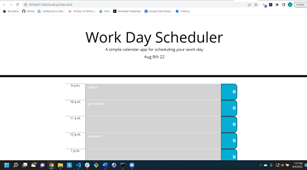

# Work Day Scheduler

## User Story

- As an employee with a busy schedule, I want to add important events to a daily planner so that I can manage my time effectively

## Acceptance Criteria

- When I open the planner, then the current day is displayed at the top of the calendar

- When I scroll down, then I am presented with time blocks for standard business hours

- When I view the time blocks for that day, then each time block is color-coded to indicate whether it is in the past, present, or future

- When I click into a time block, then I can enter an event

- When I click the save button for that time block, then the text for that event is saved in local storage

- When I refresh the page, then the saved events persist

## Repository Link

- Repository can be found at:
  [GitHub](https://github.com/susangrace909/EmployeeTracker.git)
  [Live](https://susangrace909.github.io/EmployeeTracker/)

## Screenshot of Site:

